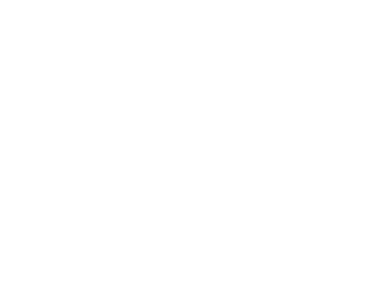

<h1 align="center">Dice Command</h1>

    
    
        
    
    

A Powercord plugin that adds a command that simulates a dice. You are able to specify how many sides the dice has, however it defaults to 6 if you don't put anything.
